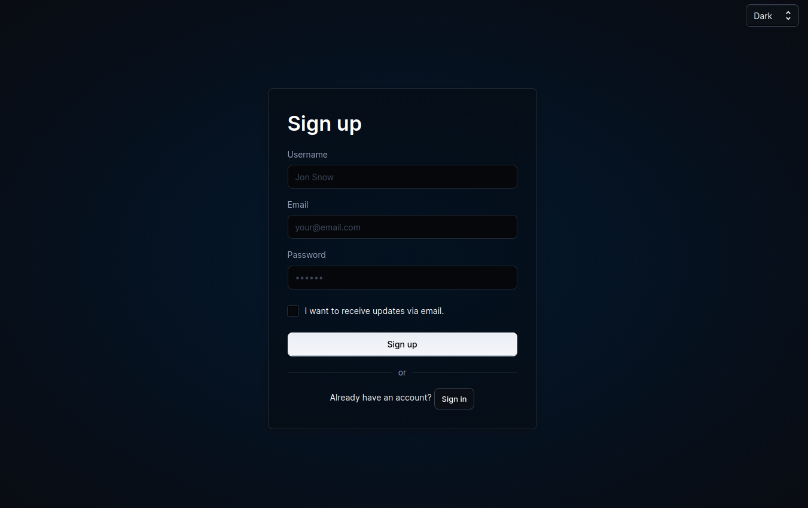
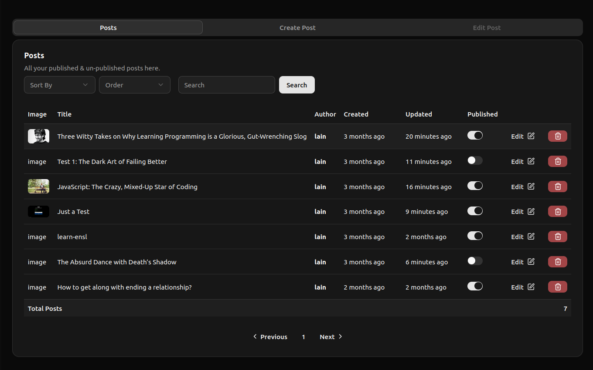
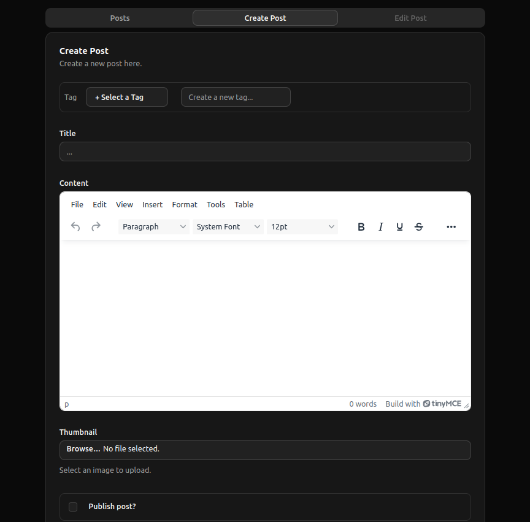

# Admin Panel - Blog Management Dashboard

   

This directory contains the private client for the blog project—a secure and feature-rich admin panel built with React and Vite.

---

## Table of Contents
- [Overview](#overview)
- [Features](#features)
- [Tech Stack](#tech-stack)
- [Getting Started](#getting-started)
- [Screenshots]
---

## Overview

The Admin Panel provides authenticated users with the tools to manage all aspects of the blog's content. It features a modern, component-based UI built with **shadcn/ui** and is styled with **Tailwind CSS**.
*(Thanks to original repo: https://github.com/rubinimeri/blog/tree/main/frontend/private-client )*

---

## Features

-   **Post Management**: Create, read, update, and delete blog posts.
-   **Rich Text Editor**: An integrated TinyMCE editor for writing and formatting post content.
-   **Content Publishing**: Toggle the visibility of posts between `published` and `unpublished` states.
-   **Dynamic Dashboard**: View all posts in a sortable and searchable table.
-   **Secure Access**: The panel is protected and requires JWT-based authentication provided by the backend.

---

## Tech Stack

-   **Framework**: React (with Vite)
-   **UI Components**: shadcn/ui
-   **Styling**: Tailwind CSS
-   **Forms**: React Hook Form with Zod for validation
-   **Routing**: React Router
-   **Rich Text Editing**: TinyMCE

---

## Getting Started

1.  **Navigate to this Directory:**
    ```bash
    cd Frontend/private-client
    ```

2.  **Install Dependencies:**
    Make sure you have Node.js and npm/yarn installed.
    ```bash
    npm install
    ```

3.  **Run the Development Server:**
    Ensure the backend server is running first.
    ```bash
    npm run dev
    ```

The Admin Panel will be available at a local port, typically `http://localhost:5174` or the next available one.

## Screenshots

**Sign-up Page**


**Admin Panel**


**Create Post**


