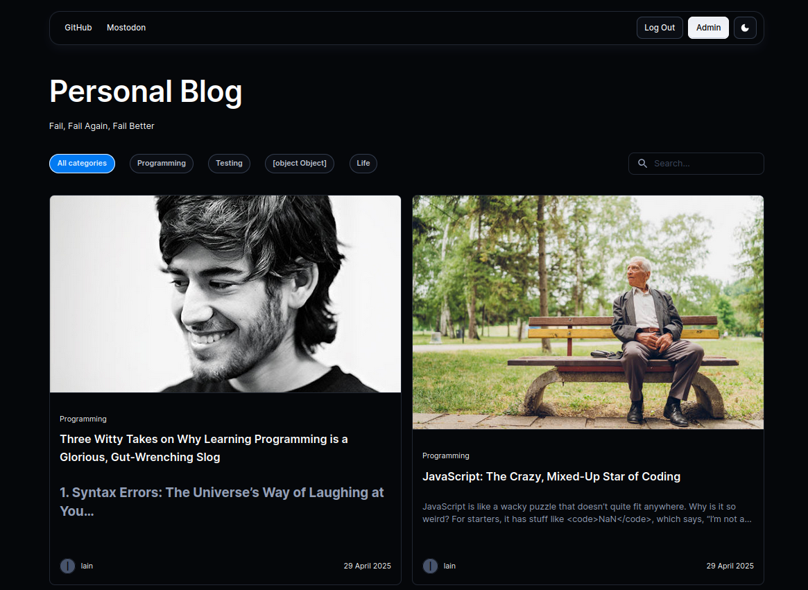
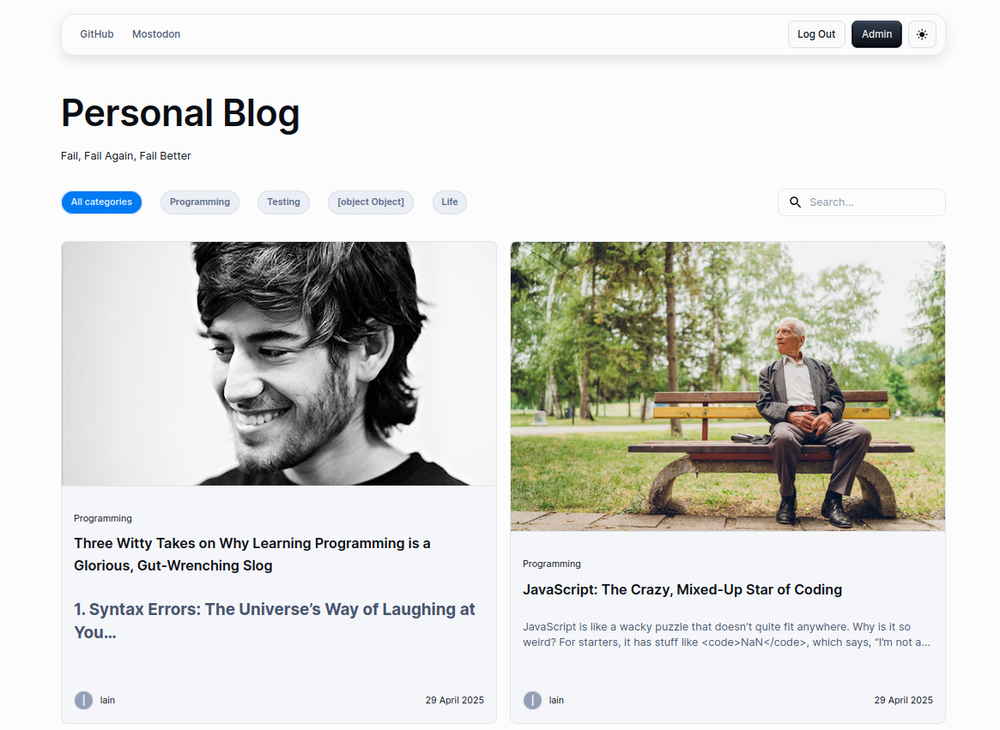
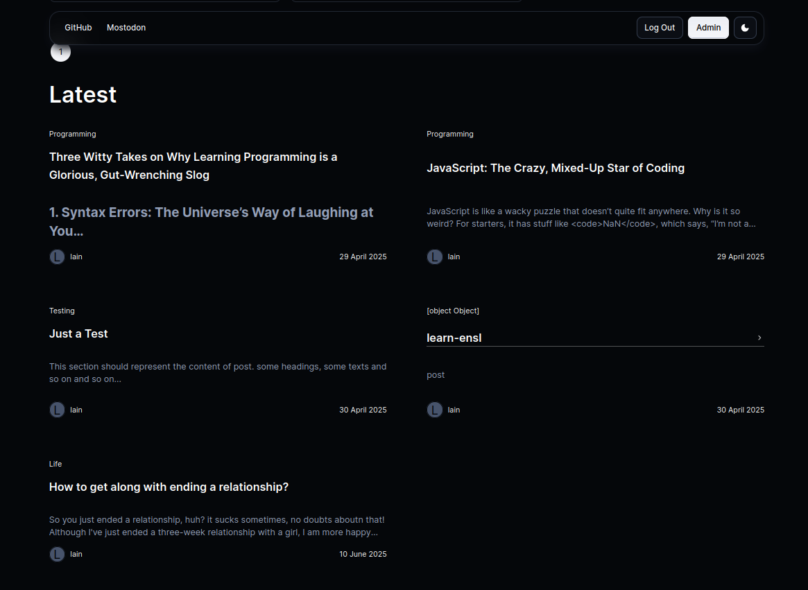
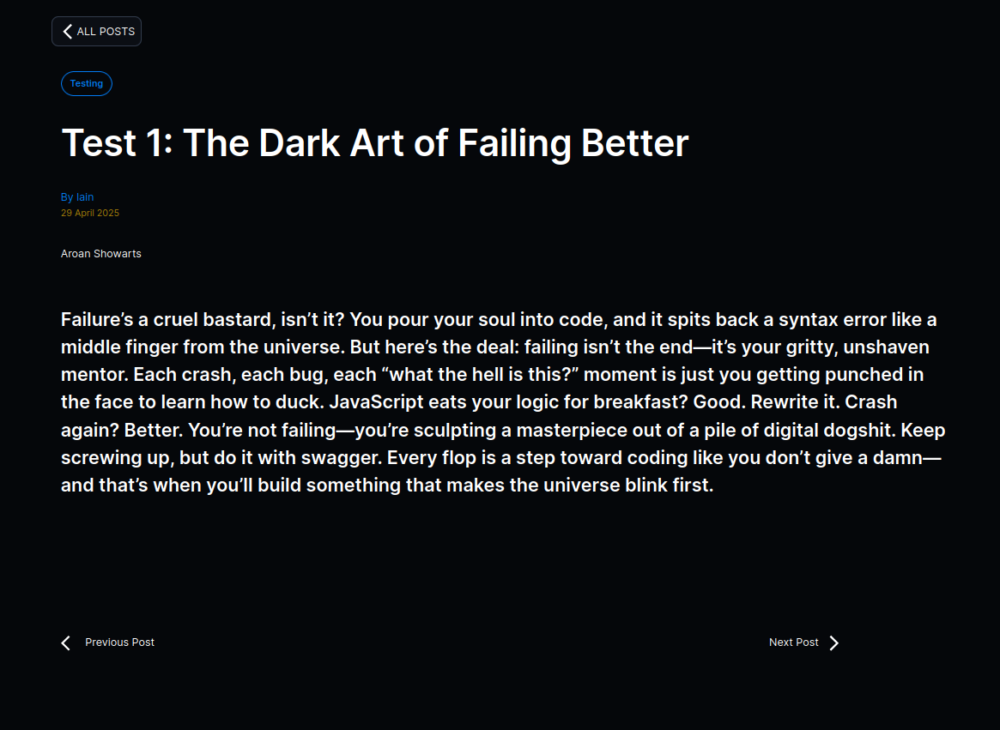
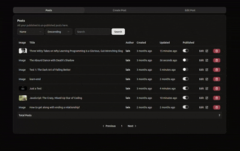

# Full-Stack JamStack Blog - TOP

[](https://www.repostatus.org/#wip)
         

A modern blog platform built with Node.js/Express.js **backend** and React frontends, following **JamStack principles**. Features a RESTfull API, PostgreSQL database with Prisma ORM, JWT authentication, and two distinct frontends: an **admin panel** and a **public blog**.



---

## Table of Contents

-   [Project Structure](#project-structure)
-   [Tech Stack](#tech-stack)
-   [Getting Started](#getting-started)
-   [Screenshots](#screenshots)
-   [Contributing](#contributing)

## Project Structure

```
.
├── backend/         # Node.js API, Prisma schema, etc.
└── frontend/
    ├── private-client/  # Admin Panel (shadcn/ui)
    └── public-client/   # Public Blog (Material-UI)
```

## Tech Stack

- **Backend**

  - Node.js
  - Express.js
  - Prisma
  - PostgreSQL
  - JWT
  - Cloudinary

- **Frontend**
  - React (Vite)
  - shadcn/ui (Admin)
  - Material-UI (Public)
  - React Router
  - Tailwind CSS (pre-built)

## Getting Started

Follow these steps to run the project locally.

**1. Prerequisites:**

- Node.js
- PostgreSQL
- `npm` or `yarn`

**2. Setup & Configuration:**

- Clone the repository: `git clone https://github.com/your-username/your-repo-name.git`
- Install dependencies in all three directories (`/backend`, `/frontend/public-client`, `/frontend/private-client`):

```bash
npm install
```

- In the `/backend` directory, create a `.env` file and provide your `DATABASE_URL` and `JWT_SECRET`.
- Run database migrations from the `/backend` directory:
  ```bash
  npx prisma migrate dev
  ```

**3. Run the Application:**

You will need three separate terminal windows to run the full application.

- **Backend Server** (from `/backend`):
  ```bash
  node app.js
  ```
- **Public Client** (from `/frontend/public-client`):
  ```bash
  npm run dev
  ```
- **Admin Panel** (from `/frontend/private-client`):
  ```bash
  npm run dev
  ```

---

## Screenshots








### Admin Panel

---

## Contributing

Contributions are welcome. Please fork the repository, create a feature branch, and open a pull request. For bugs and feature requests, please open an issue on the repository's "Issues" tab.
